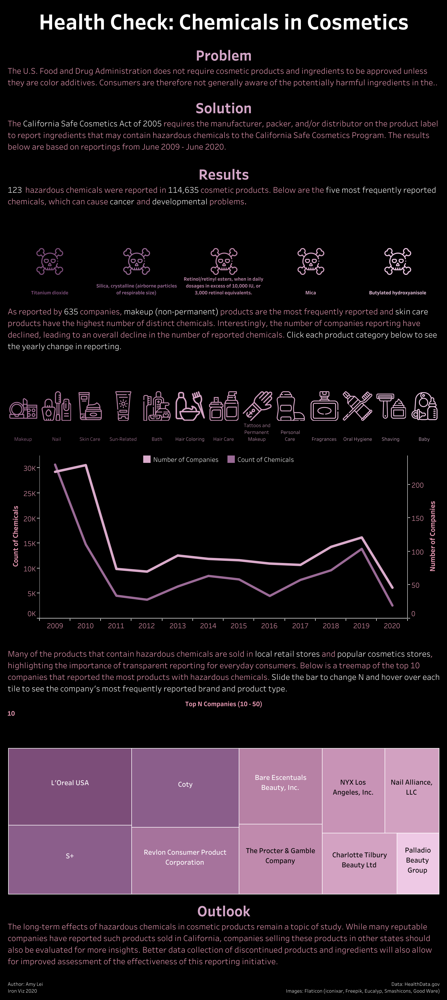
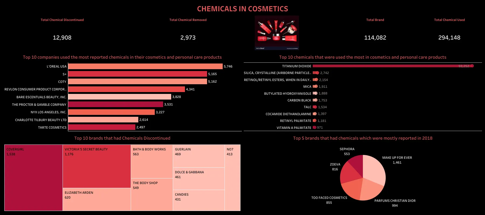

```{r}
#|ooutput: false
library(magick)

# Re-save all images as proper PNG
image_read(here::here("images", "yanfei-toxic-beauty.png")) %>%
  image_write(here::here("images", "yanfei-toxic-beauty.png"), format = "png")

image_read(here::here("images", "amylei-chemicals-cosmetics.png")) %>%
  image_write(here::here("images", "amylei-chemicals-cosmetics.png"), format = "png")

image_read(here::here("images", "hand-drawing.png")) %>%
  image_write(here::here("images", "hand-drawing.png"), format = "png")
```

## Some pre-planning

**Q1. Restate the questions you hope to answer with your inforgraphic. This should include one overarching question (think of this as driving the overall theme of your infographic) and at least three subquestions (each of which will be addressed by your infographic’s component visualizations). Have these questions changed at all since FPM #1? If yes, how so?**

**Answer:**\
**Overarching Question:** What harmful chemicals are present in cosmetic products sold in California, and which brands and product types contain them most frequently?

**Subquestions:**\
1. Which harmful chemicals are frequently used in different brands and product types?\
2. What are the most common harmful chemicals in cosmetics?\
3. Which brands use the most harmful chemicals?\

No, my preliminary questions have not changed. The first visualization already answered my subquestion 2. It showed that Titanium Dioxide is the most commonly reported chemical in cosmetic products, followed by Crystalline Silica and Cocamide Diethanolamine. The other two subquestions can be answered with my data set, but will require significant data cleaning and wrangling. I want to continue exploring the data, and if I discover new insights, I may consider changing the questions.

**Q2. Explain which variables from your data set(s) you will use to answer the above questions, and how.**

**Answer:** I have one data set from the California Safe Cosmetics Program (CSCP), which contains information about cosmetic products sold in California that contain chemicals known or suspected to cause cancer, birth defects, or other reproductive harm. The data set has 114,635 rows and 24 columns.

For subquestion 1, I will clean, wrangle and group the data. I will use three variables: `chemical_name` (the name of the reported chemical), `brand_name` (the brand selling the product), and `primary_category` (the product type such as Makeup Products, Nail Products, or Skin Care Products). I will count how many products contain each chemical within each brand and product type. This will give me three variables to visualize: chemical name, brand name and product count.

For subquestion 2, I will group the data by `chemical_name` and count the number of unique products using `cdph_id`, a unique identifier for each product. This will give me chemical name and product count to visualize. My exploratory analysis already showed that Titanium Dioxide is the most common, appearing in over 25,000 products.

For subquestion 3, I will group the data by `brand_name` and calculate the number of unique products with reported chemicals (`cdph_id`) and the number of unique chemicals used (`chemical_name`). This will give me three variables to visualize: brand name, product count and chemical count.

**Q3. In FPM #2, you created some exploratory data viz to better understand your data. You may already have some ideas of how you plan to formally visualize your data, but it’s incredibly helpful to look at visualizations by other creators for inspiration. Find at least two data visualizations that you could (potentially) borrow / adapt pieces from. Download and embed them into your drafting-viz.qmd file, and explain which elements you might borrow (e.g. the graphic form, legend design, layout, etc.).**

```{r}
#| eval: true
#| echo: false
#| fig-align: "center"
#| out-width: "100%"
#| fig-alt: "Chemicals in Cosmetics Tableau Dashboard by Amy Lei showing interactive filters and multiple chart types analyzing the CSCP dataset"

```

This infographic was created by data scientist Amy Lei for Tableau's 2020 Iron Viz competition. It uses the same California Safe Cosmetics Program data set that I am using for my project. I really like the storytelling structure of this infographic, which is organized into clear sections: Problem, Solution, Results, and Outlook. This makes it easy for viewers to follow and understand why the data matters. The top five chemicals are shown with simple icons, which helps make the information more visual and memorable. I might borrow the idea of using small icons for each product category, like the row of cosmetic symbols for makeup, nail, skin care, and others. The dual-axis line chart is effective at showing two related trends over time: the count of chemicals and the number of companies reporting. I also like the treemap at the bottom, which shows the top companies by size, making it easy to compare them at a glance. The dark background with pink and purple accent colors creates a clean and modern look.

```{r}
#| eval: true
#| echo: false
#| fig-align: "center"
#| out-width: "100%"
#| fig-alt: "Toxic Beauty visualization by Yanfei Wu showing horizontal bar charts of most common chemicals and product categories in the CSCP dataset"

```

This infographic was created by data analyst Maureen Okene using SQL and Tableau, and the data was extracted from kaggle. I really like the layout. At the top, there are four big numbers that summarize the whole dataset, giving viewers a quick overview before they look at the details below. The horizontal bar charts are clean and easy to read, showing the top companies and top chemicals side by side. I might borrow the idea of using a treemap to show which brands had the most harmful chemicals, since the size of each box makes it easy to compare brands at a glance. I also like the consistent pink and coral color scheme and connects to the cosmetics theme. The dark background makes the charts stand out clearly.

## Hand-draw your anticipated visualizations


## Load necessary packages

```{r}
#| label: load-packages

# Load libraries
library(janitor)
library(packcircles)
library(scales)
library(viridis)
library(lubridate)
library(showtext)
library(glue)
library(ggtext)
library(here)
library(tidyverse)
```

## Load necessary fonts

```{r}
#| label: import-fonts

# Import Google fonts
font_add_google(name = "Jost", family = "jost")
font_add_google(name = "EB Garamond", family = "eb-garamond")
font_add_google(name = "Libre Caslon Display", family = "libre-caslon-display")

# Import font awesome fonts
font_add(family = "fa-brands",
         regular = here::here("fonts", "Font Awesome 7 Brands-Regular-400.otf"))

font_add(family = "fa-solid",
         regular = here::here("fonts", "Font Awesome 7 Free-Solid-900.otf"))

# Enable {showtext} for text rendering
showtext_auto()         
showtext_opts(dpi = 300)
```

## Read the dataset

```{r}
#| label: load-data
#| output: false

# Read the CSV file
cscp_raw <- read_csv(here::here("data", "cscpopendata.csv")) %>% 
  clean_names()

```

```{r}
#| label: data-summary
#| output: false

# Basic summary statistics
cat("Dataset Dimensions:", nrow(cscp_raw), "rows x", ncol(cscp_raw), "columns\n")
cat("\nColumn Names:\n")
print(names(cscp_raw))
```

## Data cleaning & wrangling

```{r}
#| label: clean-data

# Clean the data
cscp_clean <- cscp_raw %>%
  # Convert column names to snake_case
  clean_names() %>%
  # Parse date columns
  mutate(
    initial_date_reported = mdy(initial_date_reported),
    most_recent_date_reported = mdy(most_recent_date_reported),
    discontinued_date = mdy(discontinued_date),
    chemical_created_at = mdy(chemical_created_at),
    chemical_updated_at = mdy(chemical_updated_at),
    chemical_date_removed = mdy(chemical_date_removed)) %>%
  # Extract year from initial date reported
  mutate(report_year = year(initial_date_reported)) %>%
  # Clean text columns (remove leading/trailing whitespace)
  mutate(
    primary_category = str_trim(primary_category),
    sub_category = str_trim(sub_category),
    chemical_name = str_trim(chemical_name),
    company_name = str_trim(company_name),
    brand_name = str_trim(brand_name))

```

## Define color palette

```{r}
#| label: define-colors

# Create color palette
pal <- c(
  "blush"      = "#f9a8d4",   # soft blush pink — bubble low values
  "orchid"     = "#e040a0",   # vivid pink-magenta — bubble high values  
  "sky"        = "#67c9d8",   # ocean sky teal — accent
  "champagne"  = "#fde68a",   # warm champagne gold — highlight accent
  "bg"         = "#eaf6fa",   # ocean mist — main light background ✨
  "panel"      = "#f5fbfd",   # pearl white — inner panel background ✨
  "title"      = "#1e3d4f",   # deep ocean navy — titles
  "text"       = "#4a6e80",   # muted teal-slate — subtitles, captions, axis
  "grid"       = "#c2e4ef"    # powder blue — soft dotted grid lines ✨
)

# Preview palette
monochromeR::view_palette(pal)
```

## Question 1

**Which harmful chemicals are frequently used in different product types?**

### Data wrangling

```{r}
#| label: q1-data-wrangling

# Count products per chemical per category
chemicals_by_category <- cscp_clean %>%
 group_by(primary_category, chemical_name) %>%
 summarise(product_count = n_distinct(cdph_id),
           .groups = "drop")

# Get top 6 categories by total products
top_6_categories <- cscp_clean %>%
 group_by(primary_category) %>%
 summarise(total_products = n_distinct(cdph_id)) %>%
 arrange(desc(total_products)) %>%
 slice_head(n = 6) %>%
 pull(primary_category)

# Get top 10 chemicals by total products
top_10_chemicals <- cscp_clean %>%
 group_by(chemical_name) %>%
 summarise(total_products = n_distinct(cdph_id)) %>%
 arrange(desc(total_products)) %>%
 slice_head(n = 10) %>%
 pull(chemical_name)

# Filter to top categories and chemicals
chemicals_by_category_filtered <- chemicals_by_category %>%
 filter(
   primary_category %in% top_6_categories,
   chemical_name %in% top_10_chemicals
 ) %>%
 # Shorten chemical names for display
 mutate(
   chemical_short = case_when(
     str_detect(chemical_name, "Titanium") ~ "Titanium dioxide",
     str_detect(chemical_name, "Silica") ~ "Crystalline silica",
     str_detect(chemical_name, "Retinol") ~ "Retinol/retinyl esters",
     str_detect(chemical_name, "Butylated") ~ "BHA",
     str_detect(chemical_name, "Cocamide") ~ "Cocamide DEA",
     str_detect(chemical_name, "Carbon") ~ "Carbon black",
     TRUE ~ chemical_name
   ),
   # Shorten category names
   category_short = case_when(
     str_detect(primary_category, "Makeup") ~ "Makeup",
     str_detect(primary_category, "Skin Care") ~ "Skin Care",
     str_detect(primary_category, "Hair Care") ~ "Hair Care",
     str_detect(primary_category, "Sun") ~ "Sun Products",
     str_detect(primary_category, "Nail") ~ "Nail Products",
     str_detect(primary_category, "Bath") ~ "Bath Products",
     TRUE ~ primary_category
   )
 )
```

### Visualization for harmful chemicals used in different product types

```{r}
# Create title
title_rq1 <- glue::glue("Which <span style='color:{pal['orchid']};'>Chemicals</span>&nbsp;Are Found in Which Product Types?")

# Create caption
github_icon <- "&#xf09b"
github_username <- "aakriti-poudel-chhetri"
caption_rq1 <- glue::glue("Source: California Safe Cosmetics Program (CSCP) | 2009-2020<br> <span style='font-family:fa-brands;'>{github_icon};</span> {github_username}")

# Visualize the data — Normal Heatmap
chemical_product_category_plot <- chemicals_by_category_filtered %>%
  ggplot(aes(x = category_short,
             y = reorder(chemical_short, product_count),
             fill = product_count)) +
  geom_tile(color = pal["bg"],
            linewidth = 0.2) +
  geom_text(aes(label = comma(product_count)),
            color  = pal["title"],
            size   = 5,
            family = "eb-garamond") +
  scale_fill_gradient(low    = pal["blush"],
                      high   = pal["champagne"],
                      labels = comma,
                      name   = "Product categories") +
  labs(title    = title_rq1,
       subtitle = "Titanium dioxide dominates across all categories, especially in makeup products",
       x        = NULL,
       y        = NULL,
       caption  = caption_rq1) +
  theme_minimal() +
  theme(plot.background  = element_rect(fill = pal["bg"], color = NA),
        panel.background = element_rect(fill = pal["bg"], color = NA),
        panel.grid = element_blank(),
        plot.title.position = "plot",
        plot.title = ggtext::element_markdown(family = "jost",
                                              face   = "bold",
                                              size   = 18,
                                              color  = pal["title"],
                                              margin = margin(b = 5)),
        plot.subtitle = element_text(family = "eb-garamond",
                                     size   = 14,
                                     color  = pal["text"],
                                     margin = margin(b = 15)),
        plot.caption = ggtext::element_markdown(family = "eb-garamond",
                                                face   = "italic",
                                                size   = 10,
                                                color  = pal["text"],
                                                hjust  = 1,
                                                margin = margin(t = 18)),
        axis.text.x = element_text(family = "eb-garamond",
                                   size   = 13,
                                   color  = pal["text"],
                                   angle  = 35,
                                   hjust  = 1),
        axis.text.y = element_text(family = "eb-garamond",
                                   size   = 13,
                                   color  = pal["text"]),
        legend.background = element_rect(fill = pal["bg"], color = NA),
        legend.title = element_text(family = "eb-garamond",
                                    size   = 12,
                                    color  = pal["title"]),
        legend.text = element_text(family = "eb-garamond",
                                   size   = 12,
                                   color  = pal["text"]),
        legend.position = "right",
        plot.margin = margin(t = 1, r = 1, b = 1, l = 1, "cm")
  )

# Enable {showtext} for text rendering
showtext_auto(enable = TRUE)

# Print plot
chemical_product_category_plot

# Turn off {showtext} 
showtext_auto(enable = FALSE)

```

```{r}
#| label: save-chemical_product_category_plot
#| eval: false

# Enable {showtext}
showtext_auto(enable = TRUE)
showtext_opts(dpi = 300)

# Save plot as png
ggsave(filename = here::here("images", "chemical_product_category_plot.png"),
       plot = chemical_product_category_plot,
       device = "png",
       width = 12,
       height = 8,
       unit = "in",
       dpi = 300)

# Turn off {showtext}
showtext_auto(enable = FALSE)
```

## Question 2

**Which brands use the most harmful chemicals?**

### Data wrangling

```{r}
#| label: q2-data-wrangling
#| output: false

# Identify top 15 brands for name standardization
top_15_brands <- cscp_clean %>%
  # Normalize brand names, convert to uppercase and strip leading/trailing
  mutate(brand_name = str_to_upper(str_trim(brand_name))) %>%
  # Count unique products per brand using cdph_id
  group_by(brand_name) %>%
  summarise(product_count = n_distinct(cdph_id)) %>%
  # Sort highest to lowest
  arrange(desc(product_count)) %>%
  print(n = 15)

# Vector of top 15 brand keywords to check for naming inconsistencies
brands_to_check <- c("REVLON", "THE BODY SHOP", "ANASTASIA", "GELISH", 
                     "SEPHORA", "VICTORIA", "ENTITY", "ARTISTIC", "AVON", 
                     "BATH & BODY", "INNISFREE", "CHINA GLAZE", "ZOEVA", 
                     "IBD", "TARTE")

cscp_clean %>%
  # Normalize brand names before filtering so case differences don't cause misses
  mutate(brand_name = str_to_upper(str_trim(brand_name))) %>%
  filter(str_detect(brand_name, paste(brands_to_check, collapse = "|"))) %>%
  # Keep only unique brand name strings
  distinct(brand_name) %>%
  arrange(brand_name) %>%
  print(n = 2396)

```

```{r}
#| label: prepare-data

# Load clean top_brands and prevents duplicate
top_brands <- cscp_clean %>%
  mutate(
    brand_name = str_to_upper(str_trim(brand_name)),
    brand_name = case_when(
      str_detect(brand_name, "REVLON")            ~ "REVLON",
      str_detect(brand_name, "SEPHORA")           ~ "SEPHORA",
      str_detect(brand_name, "ANASTASIA")         ~ "ANASTASIA BEVERLY HILLS",
      str_detect(brand_name, "ARTISTIC")          ~ "ARTISTIC",
      str_detect(brand_name, "ENTITY")            ~ "ENTITY",
      str_detect(brand_name, "CHINA GLAZE")       ~ "CHINA GLAZE",
      str_detect(brand_name, "IBD")               ~ "IBD",
      str_detect(brand_name, "GELISH")            ~ "GELISH",
      str_detect(brand_name, "TARTE")             ~ "TARTE",
      str_detect(brand_name, "THE BODY SHOP")     ~ "THE BODY SHOP",
      str_detect(brand_name, "BATH & BODY|HBATH") ~ "BATH & BODY WORKS",
      str_detect(brand_name, "VICTORIA")          ~ "VICTORIA'S SECRET BEAUTY",
      TRUE ~ brand_name
    )
  ) %>%
  group_by(brand_name, company_name) %>%
  summarise(
    product_count  = n_distinct(cdph_id),
    chemical_count = n_distinct(chemical_name),
    .groups = "drop"
  ) %>%
  arrange(desc(product_count)) %>%
  slice_head(n = 15)

```

# Visulaization for the brands using most harmful chemicals

```{r}
#| label: rq2-bubble-chart
#| fig-width: 12
#| fig-height: 10
#| fig-alt: "Packed bubble chart showing which brands use the most harmful chemicals"
#| warning: false

# Compute circle packing layout 
packing <- circleProgressiveLayout(top_brands$chemical_count, sizetype = "area")

# Attach packing coordinates back to brand data 
top_brands <- top_brands %>%
  bind_cols(packing) %>%
  mutate(
    id   = row_number(),
    tier = case_when(
      chemical_count >= quantile(chemical_count, 0.80) ~ "High (8-10)",
      chemical_count >= quantile(chemical_count, 0.50) ~ "Medium (4-7)",
      TRUE                                             ~ "Low (1-3)"
    ),
    fill_col = case_when(
      tier == "High (8-10)"  ~ unname(pal["orchid"]),
      tier == "Medium (4-7)" ~ unname(pal["sky"]),
      TRUE                   ~ unname(pal["champagne"])
    ),
    label = str_wrap(brand_name, 10)
  )

# Join fill_col onto polygon data for fill mapping 
data_gg <- circleLayoutVertices(packing, npoints = 100) %>%
  left_join(top_brands %>% select(id, fill_col), by = "id")

# Create title 
title2 <- glue::glue("The Brands <span style='color:{pal['orchid']};'>Most</span> <span style='color:{pal['sky']};'>Chemically</span> <span style='color:#EAC42B;'>Compromised</span>")

# Create caption 
github_icon     <- "&#xf09b"
github_username <- "aakriti-poudel-chhetri"
caption2 <- glue::glue("Source: California Safe Cosmetics Program (CSCP)<br><span style='font-family:fa-brands;'>{github_icon};</span> {github_username}")

# Plot bubble chart
brands_chemical_content <- ggplot() +
  # Layer 1: Fill circle polygons colored by chemical count tier
  geom_polygon(
    data      = data_gg,
    aes(x, y, group = id, fill = fill_col),
    colour    = pal["panel"],
    linewidth = 0.8,
    alpha     = 0.88
  ) +
  # Use hex values directly
  scale_fill_identity(
    guide  = "legend",
    labels = c("High (8-10)", "Medium (4-7)", "Low (1-3)"),
    breaks = c(unname(pal["orchid"]), unname(pal["sky"]), unname(pal["champagne"]))
  ) +
  # Layer 2: Chemical count near top-center of each circle
  geom_text(
    data     = top_brands,
    aes(x, y + radius * 0.12, label = chemical_count, size = radius),
    fontface = "bold", family = "jost", colour = "gray20"
  ) +
  # Layer 3: Brand name near bottom-center of each circle
  geom_text(
    data       = top_brands,
    aes(x, y - radius * 0.28, label = label, size = radius * 0.48),
    family     = "jost", colour = "gray20",
    lineheight = 0.85, alpha = 0.92
  ) +
  # Hide the radius size legend — explained by circle size visually
  scale_size_continuous(range = c(2, 9), guide = "none") +
  coord_equal() +
  labs(
    title    = title2,
    subtitle = "**SEPHORA leads with 10 distinct harmful chemicals**, nearly 3× more than most brands in the top 15",
    caption  = caption2,
    fill     = "Chemical count"
  ) +
  theme_void(base_family = "eb-garamond") +
  theme(
    plot.background  = element_rect(fill = pal["panel"], colour = NA),
    panel.background = element_rect(fill = pal["panel"], colour = NA),
    # element_markdown() needed to render HTML color spans in title
    plot.title = element_markdown(
      family = "eb-garamond", size = 25, face = "bold",
      colour = pal["title"], margin = margin(b = 6)
    ),
    plot.subtitle = element_markdown(
      family = "jost", size = 14, colour = pal["text"],
      margin = margin(b = 15)
    ),
    # face = "italic" is correct, font = "italic" does not exist
    plot.caption = element_markdown(
      family = "eb-garamond", size = 12, face = "italic", colour = pal["text"],
      hjust = 1, margin = margin(t = 15)
    ),
    plot.margin        = margin(24, 24, 16, 24),
    legend.position    = "bottom",
    legend.title       = element_text(family = "eb-garamond", size = 12, colour = "gray20"),
    legend.text        = element_text(family = "eb-garamond", size = 12,  colour = "gray20"),
    legend.key.size    = unit(0.8, "cm"),
    legend.key.spacing = unit(0.4, "cm")
  )

# Enable {showtext} for text rendering
showtext_auto(enable = TRUE)

# Print plot
brands_chemical_content

# Turn off {showtext} 
showtext_auto(enable = FALSE)
```

```{r}
#| label: save-brands_chemical_content
#| eval: false

# Enable {showtext}
showtext_auto(enable = TRUE)
showtext_opts(dpi = 300)

# Save plot as png
ggsave(filename = here::here("images", "brands_chemical_content.png"),
       plot = brands_chemical_content,
       device = "png",
       width = 12,
       height = 8,
       unit = "in",
       dpi = 300)

# Turn off {showtext}
showtext_auto(enable = FALSE)
```

## Question 3

**For every 10 makeup users, how many are exposed to harmful cosmetics chemical?**

### Data wrangling

```{r}
#| label: q3-data-wrangling
#| output: false

# Total unique makeup products
total_makeup <- cscp_clean %>%
  filter(str_detect(primary_category, "Makeup")) %>%
  summarise(total = n_distinct(cdph_id)) %>%
  pull(total)

# Top 5 chemicals in makeup
top_makeup_chemicals <- cscp_clean %>%
  filter(str_detect(primary_category, "Makeup")) %>%
  group_by(chemical_name) %>%
  summarise(product_count = n_distinct(cdph_id), .groups = "drop") %>%
  arrange(desc(product_count)) %>%
  slice_head(n = 5) %>%
  pull(chemical_name)

# Top 10 sub-categories within makeup
top_makeup_subcats <- c(
  "Eye Shadow",
  "Foundations and Bases",
  "Lip Color - Lipsticks, Liners, and Pencils",
  "Lip Gloss/Shine",
  "Eyeliner/Eyebrow Pencils",
  "Face Powders",
  "Blushes",
  "Other Makeup Product",
  "Mascara/Eyelash Products",
  "Lip Balm (making a cosmetic claim)"
)

# Count products per chemical per sub-category
makeup_subcat_data <- cscp_clean %>%
  filter(
    str_detect(primary_category, "Makeup"),
    sub_category %in% top_makeup_subcats,
    chemical_name %in% top_makeup_chemicals
  ) %>%
  group_by(sub_category, chemical_name) %>%
  summarise(product_count = n_distinct(cdph_id), .groups = "drop") %>%
  mutate(
    fraction  = round(product_count / total_makeup * 10),  # ← out of 10
    unfilled  = 10 - fraction,                              # ← out of 10
    pct_label = scales::percent(product_count / total_makeup, accuracy = 1),
    chemical_short = case_when(
      str_detect(chemical_name, "Titanium")  ~ "Titanium Dioxide",
      str_detect(chemical_name, "Silica")    ~ "Crystalline Silica",
      str_detect(chemical_name, "Retinol")   ~ "Retinol/Retinyl",
      str_detect(chemical_name, "Butylated") ~ "BHA",
      str_detect(chemical_name, "Cocamide")  ~ "Cocamide DEA",
      str_detect(chemical_name, "Carbon")    ~ "Carbon Black",
      TRUE ~ chemical_name
    ),
    subcat_short = case_when(
      str_detect(sub_category, "Eye Shadow")   ~ "Eye Shadow",
      str_detect(sub_category, "Foundations")  ~ "Foundation",
      str_detect(sub_category, "Lip Color")    ~ "Lipstick",
      str_detect(sub_category, "Lip Gloss")    ~ "Lip Gloss",
      str_detect(sub_category, "Eyeliner")     ~ "Eyeliner",
      str_detect(sub_category, "Face Powders") ~ "Face Powder",
      str_detect(sub_category, "Blushes")      ~ "Blush",
      str_detect(sub_category, "Other Makeup") ~ "Other Makeup",
      str_detect(sub_category, "Mascara")      ~ "Mascara",
      str_detect(sub_category, "Lip Balm")     ~ "Lip Balm"
    ),
    chemical_short = fct_reorder(chemical_short, product_count,
                                 .fun = max, .desc = TRUE)
  )
```

### Visualization for every 10 makeup users, exposed to harmful cosmetic chemicals

```{r}
#| label: rq3-pictogram
#| fig-width: 14
#| fig-height: 12
#| fig-alt: "Pictogram chart showing for every 10 makeup users how many are exposed to harmful chemicals across 10 makeup sub-categories including Eye Shadow, Foundation, Lipstick, and others. Each person icon represents one user, with orchid colored icons showing exposure and pale blue showing no exposure."
#| warning: false

# Reshape for pictogram (10 icons in a single row)
pictogram_data <- makeup_subcat_data %>%
  select(sub_category, subcat_short, chemical_short,
         fraction, unfilled, pct_label) %>%
  pivot_longer(
    cols      = c(fraction, unfilled),
    names_to  = "status",
    values_to = "count"
  ) %>%
  uncount(count) %>%
  group_by(subcat_short, chemical_short) %>%
  mutate(
    icon_num  = row_number(),   # 1 to 10, single row
    is_filled = status == "fraction"
  ) %>%
  ungroup() %>%
  mutate(
    subcat_short = factor(subcat_short, levels = c(
      "Eye Shadow", "Foundation", "Lipstick", "Lip Gloss", "Eyeliner",
      "Face Powder", "Blush", "Other Makeup", "Mascara", "Lip Balm"
    ))
  )

# Create title
title3 <- glue::glue("For Every 10 <span style='color:{pal['orchid']};'>Makeup</span> Users, How Many Are <span style='color:{pal['sky']};'>Exposed</span> to Harmful Cosmetic Chemicals?")

# ── Create caption ─────────────────────────────────────────────────────────────
github_icon     <- "&#xf09b"
github_username <- "aakriti-poudel-chhetri"
caption3 <- glue::glue("Source: California Safe Cosmetics Program (CSCP)<br><span style='font-family:fa-brands;'>{github_icon};</span> {github_username}")

# Plot the pictogram
chemical_exposure <- ggplot(pictogram_data,
       aes(x = icon_num, y = chemical_short, colour = is_filled)) +
  # 10 person icons in a single row per chemical per subcategory
  geom_text(
    aes(label = "\uf183"),
    family = "fa-solid",
    size   = 4
  ) +
  # Percentage label at end of each row
  geom_text(
    data        = makeup_subcat_data,
    aes(x = 11.3, y = chemical_short, label = pct_label),
    inherit.aes = FALSE,
    family      = "jost",
    size        = 2.8,
    colour      = pal["orchid"],
    fontface    = "bold",
    hjust       = 0
  ) +
  scale_colour_manual(
    values = c(
      "TRUE"  = unname(pal["orchid"]),  # exposed
      "FALSE" = unname(pal["grid"])     # not exposed
    )
  ) +
  scale_x_continuous(limits = c(0.5, 13)) +
  # Chemicals as rows, subcategories as columns
  facet_wrap(~ subcat_short, ncol = 2) +
  labs(
    title    = title3,
    subtitle = "For every 10 makeup users, how many are exposed to this chemical? · <span style='color:#e040a0'>▮</span> Exposed &nbsp;<span style='color:#c2e4ef'>▮</span> Not exposed",
    caption  = caption3
  ) +
  theme_void(base_family = "eb-garamond") +
  theme(
    plot.background  = element_rect(fill = pal["bg"],    colour = NA),
    panel.background = element_rect(fill = pal["panel"], colour = NA),
    plot.title = element_markdown(
      family = "libre-caslon-display", size = 18, face = "bold",
      colour = pal["title"], margin = margin(b = 6)
    ),
    plot.subtitle = element_markdown(
      family = "eb-garamond", size = 10, colour = pal["text"],
      margin = margin(b = 14), lineheight = 1.4
    ),
    plot.caption = element_markdown(
      family = "eb-garamond", size = 9, face = "italic",
      colour = pal["text"], hjust = 1, margin = margin(t = 12)
    ),
    strip.text = element_text(
      family = "libre-caslon-display", size = 9, face = "bold",
      colour = pal["title"], margin = margin(b = 4, t = 4)
    ),
    axis.text.y = element_text(
      family = "jost", size = 8,
      colour = pal["text"], hjust = 1
    ),
    legend.position = "none",
    plot.margin     = margin(24, 24, 16, 24),
    panel.spacing   = unit(0.5, "cm")
  )

# Enable {showtext} for text rendering
showtext_auto(enable = TRUE)

# Print plot
chemical_exposure

# Turn off {showtext} 
showtext_auto(enable = FALSE)
```

```{r}
#| label: save-chemical_exposure
#| eval: false

# Enable {showtext}
showtext_auto(enable = TRUE)
showtext_opts(dpi = 300)

# Save plot as png
ggsave(filename = here::here("images", "chemical_exposure.png"),
       plot = chemical_exposure,
       device = "png",
       width = 12,
       height = 8,
       unit = "in",
       dpi = 300)

# Turn off {showtext}
showtext_auto(enable = FALSE)
```

## Answer a few last questions about your work and progress

**1. What are the key insights you want your infographic to communicate, and how will your design choices help highlight and support those messages?**

**Answer:** I want my infographic to show three things: Titanium Dioxide shows up the most across makeup products, Sephora uses the most distinct harmful chemicals of any brand, and some makeup types like Eye Shadow and Foundation expose more users to these chemicals than others. I used pink for danger/high values, bigger circles for worse brands, and person icons to make the numbers feel real.

**2. What challenges did you encounter or anticipate encountering as you continue to build / iterate on your visualizations in R? If you struggled with mocking up any of your three visualizations, describe those challenges here.**

**Answer:** The hardest part was cleaning brand names, Sephora showed up under 4 different spellings, which made their chemical count look way lower than it actually was. I also spent a lot of time debugging why my circle colors weren't showing up (it was a hyphen vs em dash issue in my code). Fonts were also tricky to get working across the whole document.

**3. What ggplot extension tools / packages do you need to use to build your visualizations? Are there any that we haven’t covered in class that you’ll be learning how to use for your visualizations?**

**Answer:** I used `packcircles` to make the bubble chart, `ggtext` to add colored words in my titles, `showtext` for custom fonts, and glue to build dynamic titles. I learned `packcircles` on my own since it was not covered in class.

**4. What feedback do you need from the instructional team and / or your peers to ensure that your intended message and key insights are clear?**

**Answer:** I want suggestion and feedback for the following questions:

a.  Does the person icon chart make sense to a regular reader?\
b.  Is showing "out of 10 people" clear enough or confusing?\
c.  Do the three charts feel like they tell one connected story, or do they feel like separate unrelated plots?
